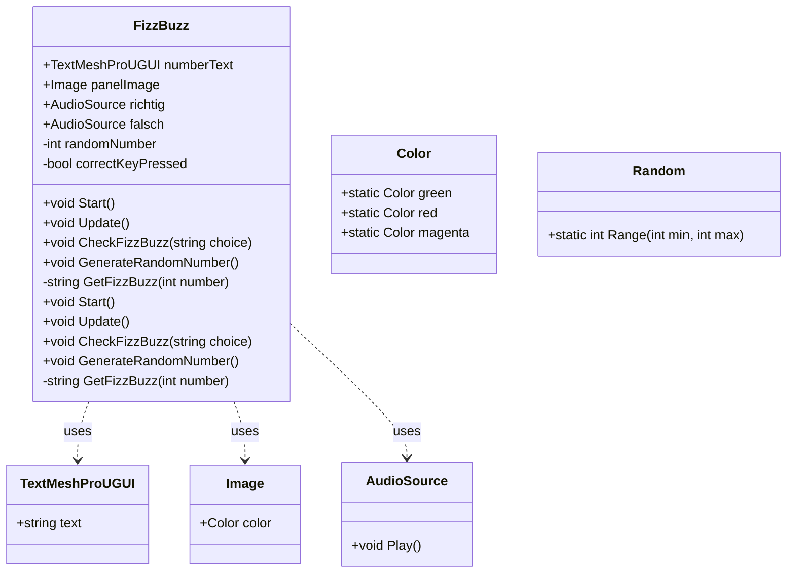

# 04-endabgabe-sbrandner

Einführung und Spielbeschreibung

In meinem Spiel geht es um die Teilbarkeitsregeln. Dieses Spiel wird Fizz Buzz genannt. Man bekommt eine Zahl gegeben, die entweder durch 3, 5, 3 und 5 oder durch keine der 3 Optionen teilbar sein muss.

Wenn die Zahl durch 3 teilbar ist, "Fizz"
Wenn die Zahl durch 5 teilbar ist, "Buzz"
Wenn die Zahl durch 3 und 5 teilbar ist, "Fizz Buzz"

Steuerung
Drücke die Pfeiltaste rechts für "Fizz Buzz"
Drücke die Pfeiltaste links für "keines von beiden"
Drücke die Pfeiltaste oben für "Fizz"
Drücke die Pfeiltaste unten für "Buzz"
Drücke die Leertaste für eine "neue Zahl"

Spielanleitung
Eine schriftliche Anleitung, wie man das Spiel spielt:

Drücken Sie auf "Play" in Unity. Dadurch wird der Startbildschirm geöffnet, drücken sie nun "start" . Im Spielbildschirm wird jetzt eine Zahl angezeigt. Mit den oben angegebenen Tasten können Sie Ihre Antwort/Vermutung eingeben.

Im Falle einer richtigen Antwort wird der Bildschirm grün.
Im Falle einer falschen Antwort wird der Bildschirm rot.
Mit der Leertaste erscheint eine neue Zahl. Dies können Sie unendlich oft wiederholen, um die Teilbarkeit zu üben.

Code-Dokumentation
UML-Diagramm:

Welche Szene muss gestartet werden? Die "Start Scene". So öffnet sich die erste Szene, die eine Anleitung enthält. Wenn man auf den Start-Button drückt, gelangt man zur Spielszene.

Personen Durchschnitt 

Benutzerfreundlichkeit:
Zwei von drei Tester sind Fortgeschritten und unter 18 der Anfänge ist über 40 

Alle drei fanden das die Benutzeroberfläche Intuitiv

Alle meiner Tester fandnen meine Anweisungen hilfreich. Um es sehr hilfreich zu gestallten könnte ich bei einem Fehler noch die Teilbarkeitsregeln anfügen.

Spielerlebnis:
Das Spiel war für alle von Mittel bis Unterhaltsam. Um es Unterhaltsmmer zu gestallten könntze ich Leben hinzufügen um den Kampfgeist zu wecke. Dies würde den Punkt der Herausfoderung auch nochmal bestärken.
Die Motivation war bei allen Mittel

Es gab keinerlei Fehler und das Spiel lief flüssig. 

Der Sound wurde bei allen testern als lustig angemerkt.

